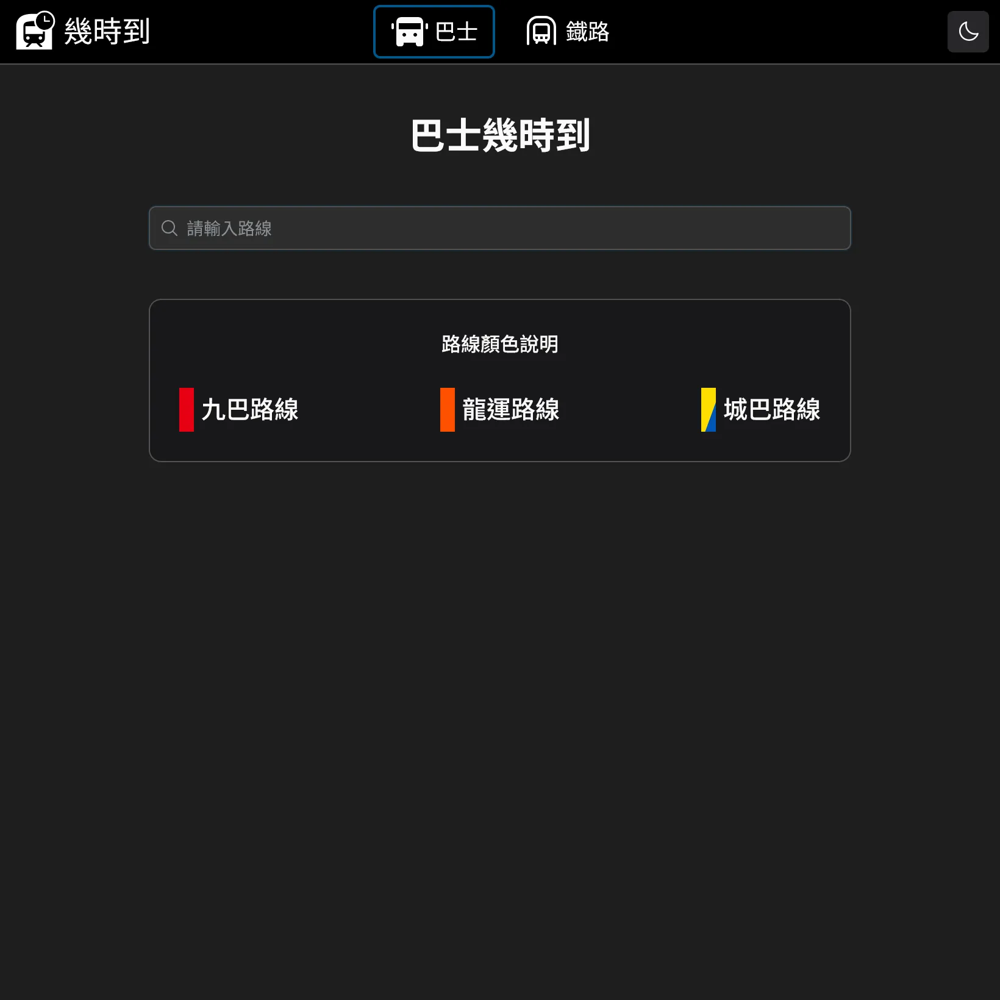
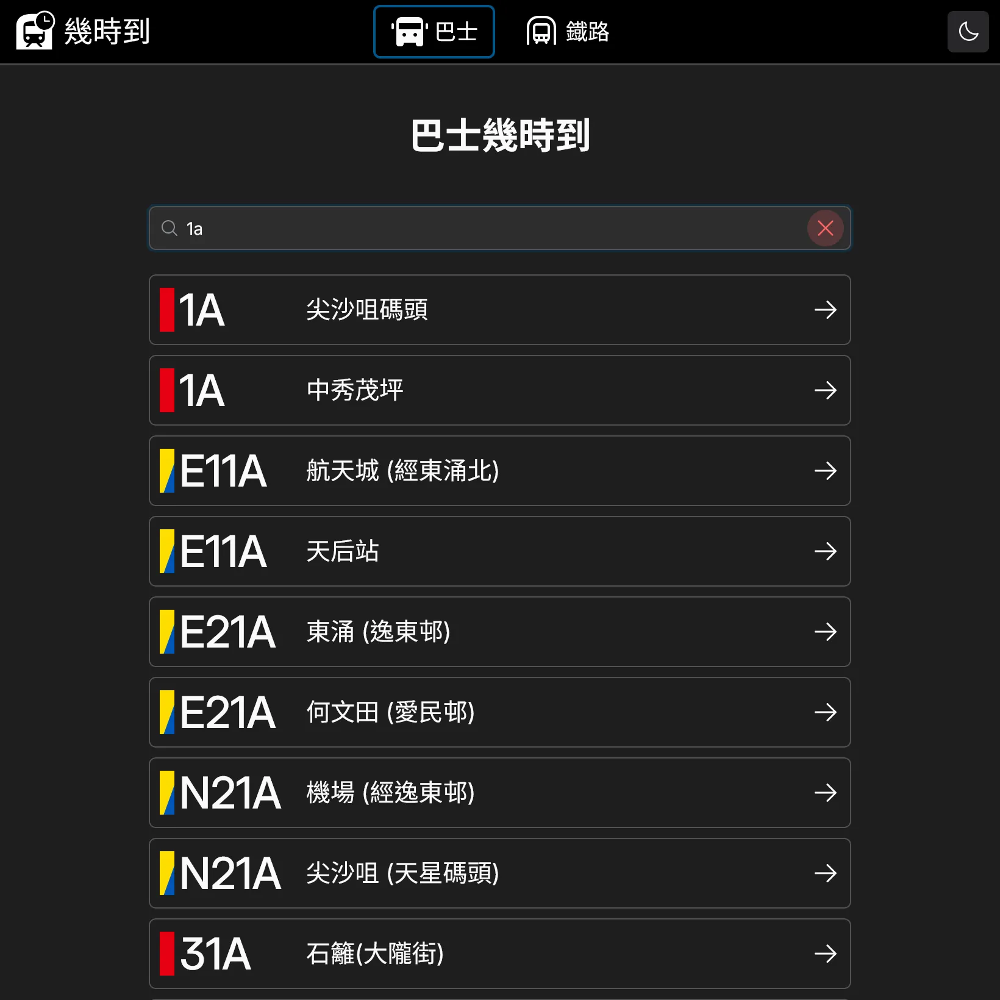
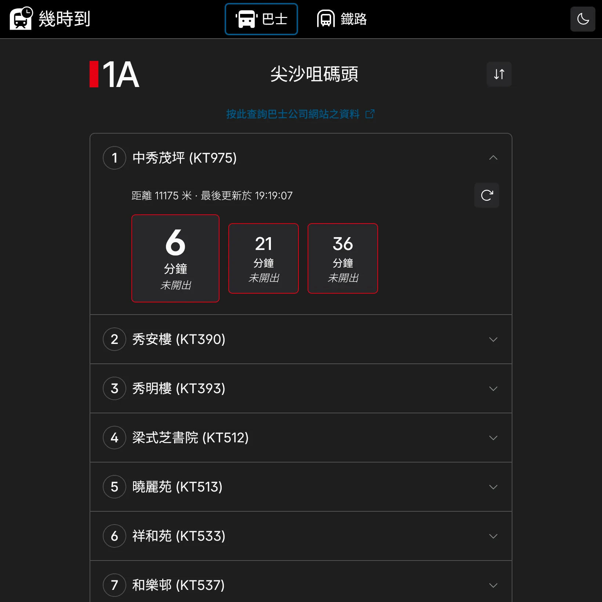
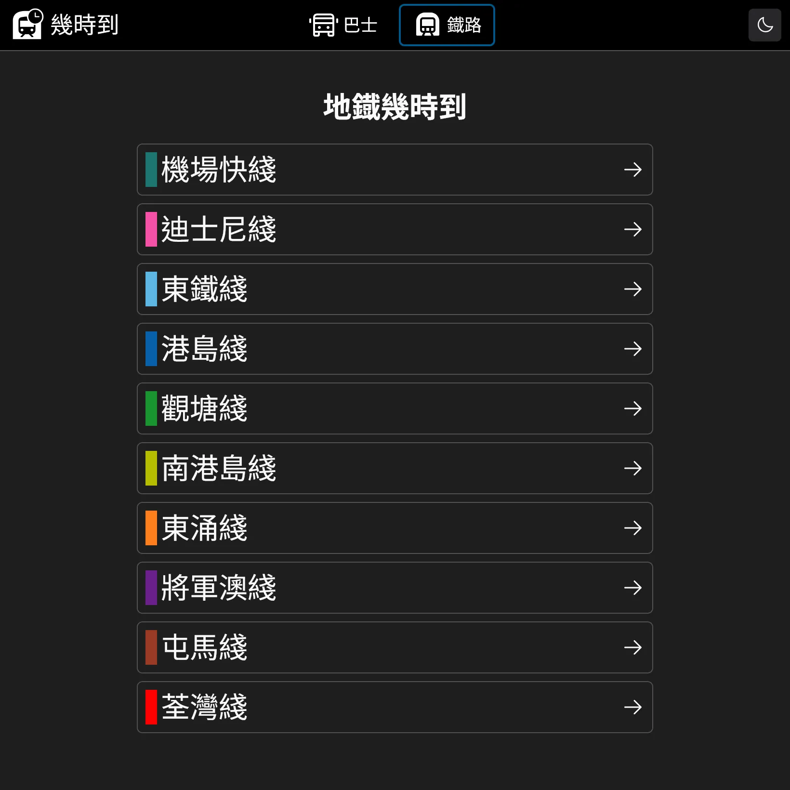
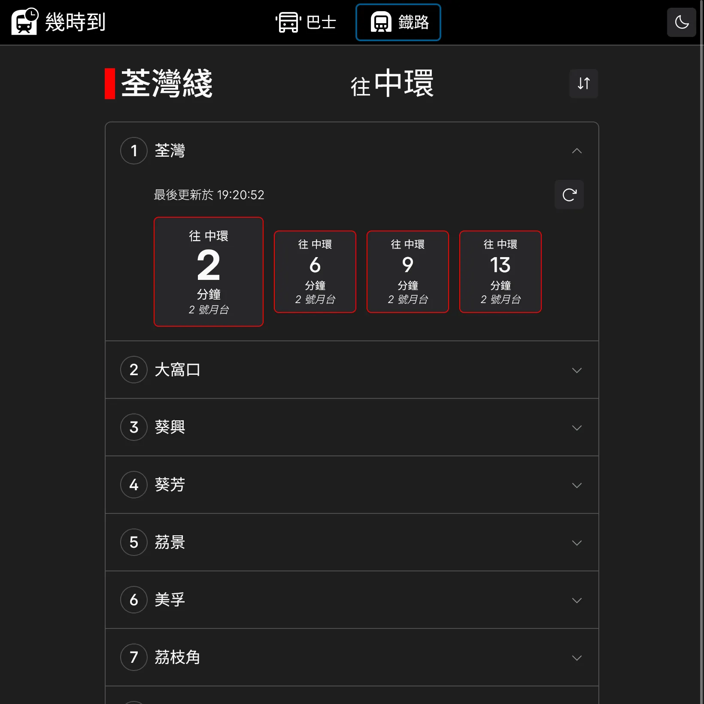
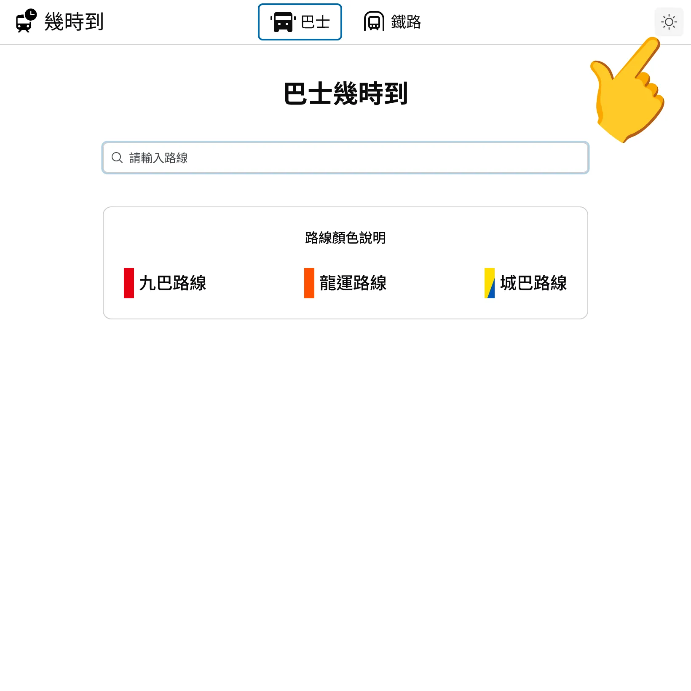

# Check ETA 幾時到

Check ETA is a React app that allows users to check the estimated time of arrival (ETA) for buses and MTR in Hong Kong.

This app has been deployed on https://check-eta.chapman-2cb.workers.dev/. The [GitHub Pages version](https://chapmankoo28.github.io/check-eta/) is the legacy version.

This app can check the ETA of these companies for now:

- [KMB](https://www.kmb.hk/)
- [LWB](https://www.kmb.hk/)
- [Citybus](https://www.citybus.com.hk/home/default.aspx?intLangID=2)
- [MTR](https://www.mtr.com.hk/ch/customer/main/index.html)

This app uses data from [data.gov.hk(資料一線通)](https://data.gov.hk/).
For the latest information, please visit their official website above.

## Usage

### For Buses

1. Search the route you want to check
2. Choose the route

3. Choose the stop

- You can swap the route direction
- ETA will be updated every 30 sec. You can also get the latest ETA by clicking the update button.

### For MTR

1. Choose the line you want to check

2. Choose the station

- You can swap the line direction
- ETA will be updated every 30 sec. You can also get the latest ETA by clicking the update button.

### Light and Dark Mode

You can toggle between light and dark mode using the theme toggle button in the top right corner.

## Built With

- Phosphor Icons
- React 19
- shadcn/ui components
- Tailwind CSS
- Tanstack/react-query
- Tanstack/react-router
- typescript/native-preview (tsgo)
- Vite

## Differences from legacy version

This app was rewritten in 2026. The legacy version ([https://chapmankoo28.github.io/check-eta/](https://chapmankoo28.github.io/check-eta/)) is still available on GitHub Pages.

Here's the diff:

| Before                | After                |
| --------------------- | -------------------- |
| JavaScript            | TypeScript           |
| CSS                   | Tailwind CSS         |
| Radix UI              | shadcn/ui components |
| React Router          | Tanstack Router      |
| Material Design Icons | Phosphor Icons       |

## Acknowledgements

- The bus route and MTR line header design was inspired by [hcrk9/signmaker/](https://github.com/hcrk9/signmaker/).
- The bus and MTR ETA display was based on my group project for COMP3423 Human Computer Interaction.
